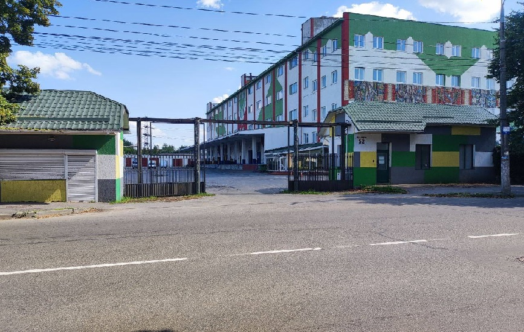
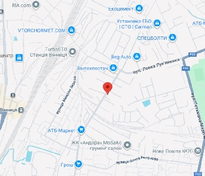

<!DOCTYPE html>
<html lang="uk">
<head>
<meta charset="UTF-8">
<meta name="viewport" content="width=device-width, initial-scale=1.0">
<title>Перефасування товару</title>

</head>
<body>

    
    
    

        
ПЕРЕФАСУВАННЯ ТОВАРУ

        

            ЯКЩО ТОВАР ПРИЇХАВ НЕ ПО ТЕХНІЧНОМУ РЕГЛАМЕНТУ - 
            ТЕЛЕФОНУЙТЕ ЗА НОМЕРОМ  
            +380 (99) 8433424 (VIBER, TELEGRAM)
        

        
ПРАЦЮЄМО З 08:30 ДО 16:30, БЕЗ ВИХІДНИХ

    

    

        
АДРЕСА:

        
м. Вінниця, вул. Максима Шимко, 52

        

           Для встановлення маршруту клікай на посилання GOOGLE MAPS знизу
        
<a href="https://maps.app.goo.gl/5n8DAiUxaGviQuiVA" target="_blank">google maps</a>

    

    

        
    

</body>
</html>
